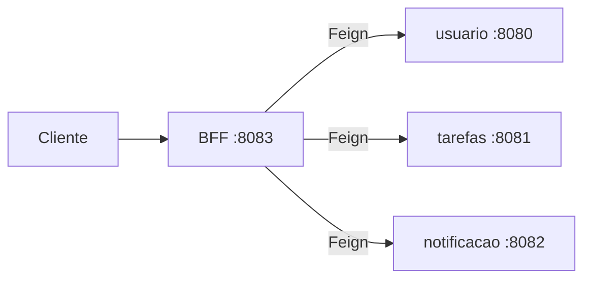
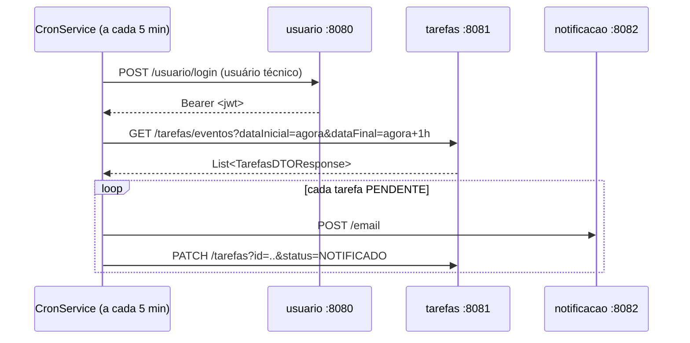

# BFF Agendador de Tarefas

**Backend for Frontend** do sistema *Agendador de Tarefas*: ponto único de entrada da API, orquestrador dos microsserviços e **agendador do job de notificação**.

Java 17 · Spring Boot 4 · OpenFeign · Spring Scheduling · OpenAPI/Swagger

> ⚠️ Código-fonte na branch **`develop`**.

---

## Papel na arquitetura

Nenhum cliente fala diretamente com os serviços de domínio. Tudo entra por aqui.

| Serviço | Porta | Banco | Responsabilidade |
|---|---|---|---|
| **bff-agendador-tarefas** (este) | 8083 | — | Fachada da API, orquestração, cron de notificação |
| [usuario](https://github.com/ntncsdata/usuario) | 8080 | PostgreSQL | Cadastro, autenticação, emissão do JWT |
| [agendadorTarefas](https://github.com/ntncsdata/agendadorTarefas) | 8081 | MongoDB | Agendamento e gestão de tarefas |
| [notificacao](https://github.com/ntncsdata/notificacao) | 8082 | — | Envio de e-mails |



O BFF é *stateless* e não tem banco: repassa o JWT recebido do cliente aos serviços downstream, que fazem a validação de verdade. Sua responsabilidade é **compor**, **agendar** e **traduzir erros**.

---

## Stack

| Camada | Tecnologia |
|---|---|
| Linguagem | Java 17 |
| Framework | Spring Boot 4.1.0 (Web MVC) |
| Comunicação entre serviços | Spring Cloud OpenFeign + feign-hc5 (Apache HttpClient 5) |
| Agendamento | Spring Scheduling (`@EnableScheduling` + `@Scheduled`) |
| Documentação | springdoc-openapi (Swagger UI) |
| Boilerplate | Lombok |
| Build | Maven |
| CI | GitHub Actions |

---

## Arquitetura interna

```
com.bff.BffAgendadorTarefas
├── BffAgendadorTarefasApplication      # @EnableFeignClients + @EnableScheduling
├── controller/
│   ├── UsuarioController               # /usuario/**
│   ├── TarefasController               # /tarefas/**
│   └── GlobalExceptionHandler          # @ControllerAdvice
├── business/
│   ├── UsuarioService · TarefasService · EmailService
│   ├── CronService                     # o job agendado
│   ├── dto/in/                         # *DTORequest  — o que entra
│   ├── dto/out/                        # *DTOResponse — o que sai
│   └── enums/StatusNotificacaoEnum
└── infrastructure/
    ├── client/                         # UsuarioClient, TarefasClient, EmailClient (Feign)
    ├── client/config/                  # FeignConfig + FeignError (ErrorDecoder)
    ├── exceptions/                     # Business, Conflict, ResourceNotFound, Unauthorized
    └── security/SecurityConfig         # @SecurityScheme do Swagger (Bearer JWT)
```

### DTOs assimétricos

Os pacotes `dto/in` e `dto/out` separam contrato de entrada e de saída:

- `TarefasDTORequest` expõe apenas `nomeTarefa`, `descricao` e `dataEvento` — o cliente não consegue forjar `id`, `emailUsuario`, `dataCriacao` ou `status`, que são responsabilidade do servidor.
- `UsuarioDTOResponse` **não carrega a senha** — o hash nunca sai pela borda da API.

### Tradução de erros

Erros dos serviços downstream não vazam como `FeignException` genérica. O `FeignError` (implementação de `ErrorDecoder`, registrada como bean em `FeignConfig`) traduz o status HTTP recebido em uma exceção de domínio, e o `GlobalExceptionHandler` a converte de volta em uma resposta HTTP coerente para o cliente:

```
downstream 409 → ConflictExceptions       → 409 CONFLICT
downstream 401 → UnauthorizedException    → 401 UNAUTHORIZED
downstream 403 → ResourceNotFoundException → 404 NOT FOUND
outros         → BusinessException
```

---

## O job de notificação (`CronService`)

É a peça que fecha o ciclo do sistema.



Características:

- **Janela**: da hora atual até uma hora à frente. Intervalo configurável por `cron.horario` (padrão `0 0/5 * * * ?` — a cada 5 minutos).
- **Idempotência**: só tarefas com status `PENDENTE` são notificadas, evitando e-mails repetidos a cada ciclo dentro da mesma hora.
- **Isolamento de falha**: cada tarefa é notificada dentro do seu próprio `try/catch`. Uma falha de SMTP não interrompe as demais do ciclo.
- **Identidade de serviço**: o cron autentica-se com um usuário técnico próprio, cujas credenciais vêm de variáveis de ambiente.

---

## Endpoints

Base: `http://localhost:8083`
Documentação interativa: **`http://localhost:8083/swagger-ui.html`**

### Usuário

| Método | Rota | Auth | Descrição |
|---|---|---|---|
| `POST` | `/usuario` | — | Cadastra usuário |
| `POST` | `/usuario/login` | — | Autentica e retorna `Bearer <jwt>` |
| `GET` | `/usuario?email=` | ✅ | Busca usuário por e-mail |
| `PUT` | `/usuario` | ✅ | Atualiza dados do usuário do token |
| `DELETE` | `/usuario/{email}` | ✅ | Remove usuário |
| `POST` | `/usuario/endereco` · `/usuario/telefone` | ✅ | Cadastra endereço / telefone |
| `PUT` | `/usuario/endereco?id=` · `/usuario/telefone?id=` | ✅ | Atualiza endereço / telefone |

### Tarefas

| Método | Rota | Auth | Descrição |
|---|---|---|---|
| `POST` | `/tarefas` | ✅ | Cria tarefa |
| `GET` | `/tarefas` | ✅ | Lista as tarefas do usuário do token |
| `GET` | `/tarefas/eventos?dataInicial=&dataFinal=` | ✅ | Lista tarefas por período (uso do cron) |
| `PUT` | `/tarefas?id=` | ✅ | Atualiza tarefa |
| `PATCH` | `/tarefas?id=&status=` | ✅ | Altera o status de notificação |
| `DELETE` | `/tarefas?id=` | ✅ | Remove tarefa |

Todos os endpoints estão documentados com `@Operation` e `@ApiResponse`, e o esquema Bearer JWT está declarado no Swagger.

---

## Como executar

### Pré-requisitos

Os três microsserviços no ar: `usuario` (8080), `agendadorTarefas` (8081), `notificacao` (8082).

### Variáveis de ambiente

```bash
export CRON_USER_EMAIL="cron@sistema.com"
export CRON_USER_SENHA="..."
```

O usuário técnico precisa existir no serviço de usuário. No IntelliJ: *Run → Edit Configurations → Environment variables*.

### Configuração (`application.properties`)

```properties
spring.application.name=BffAgendadorTarefas
server.port=8083

usuario.url=localhost:8080/usuario
agendador-tarefas.url=localhost:8081/tarefas
notificacao.url=localhost:8082/email

cron.horario=0 0/5 * * * ?

usuario.email=${CRON_USER_EMAIL}
usuario.senha=${CRON_USER_SENHA}
```

### Rodando

```bash
git checkout develop
./mvnw spring-boot:run
```

Swagger UI em `http://localhost:8083/swagger-ui.html`.

---

## Roadmap

- [ ] Mapear 403 do downstream para uma resposta 403 (hoje vira 404) e tratar `BusinessException` no `GlobalExceptionHandler`.
- [ ] Corpo de erro estruturado (timestamp, status, mensagem, path) em vez de `String`.
- [ ] Cachear o token do cron (válido por 1h) em vez de refazer login a cada ciclo.
- [ ] Resiliência nos clientes Feign: timeouts, retry e circuit breaker (Resilience4j).
- [ ] Bean Validation nos DTOs de entrada (`@Email`, `@NotBlank`, `@Future` em `dataEvento`).
- [ ] Testes unitários e de integração (WireMock para simular os downstreams).
- [ ] Merge de `develop` em `master`.

---

## Autor

**Natan** — [@ntncsdata](https://github.com/ntncsdata)
